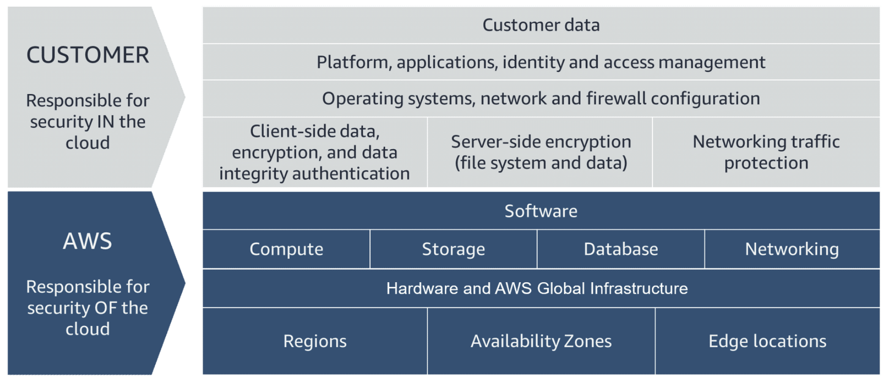

# Essentials

## Six advantages of cloud computing

Pay-as-you-go

Benefit from massive economies of scale

Stop guessing capacity

Increased speed and agility

Realize cost savings

Go global in minutes

## Globalization

Availability zone: One or more redundant data-centers.

Region: Clustered AZs.

Inside every Region is a cluster of Availability Zones. An Availability Zone consists of one or more data centers with redundant power, networking, and connectivity. These data centers operate in discrete facilities in undisclosed locations. They are connected using redundant high-speed and low-latency links.

Availability Zones also have code names. Because they are located inside Regions, they can be addressed by appending a letter to the end of the Region code name. Here are examples of Availability Zone codes:

us-east-1a is an Availability Zone in us-east-1 (N. Virginia Region).
sa-east-1b is an Availability Zone in sa-east-1 (São Paulo Region).
Therefore, if you see that a resource exists in us-east-1c, you can infer that the resource is located in Availability Zone c of the us-east-1 Region.

Region selection based on four factors:

- Compliance
- Latency
- Pricing
- Service availability

Global edge network composed by edge locations and regional edge caches.

## Scope of AWS services

Depending on the AWS service that you use, your resources are either deployed at the Availability Zone, Region, or Global level.

AWS automatically performs actions to increase data durability and availability for region-scoped services.

Some services ask you to specify an Availability Zone. With these services, you are often responsible for increasing the data durability and high availability of these resources.

A well-known best practice for cloud architecture is to use Region-scoped, managed services. These services come with availability and resiliency built in. When that is not possible, make sure your workload is replicated across multiple Availability Zones. At a minimum, you should use two Availability Zones. That way, if an Availability Zone fails, your application will have infrastructure up and running in a second Availability Zone to take over the traffic.

## Responsibilities

