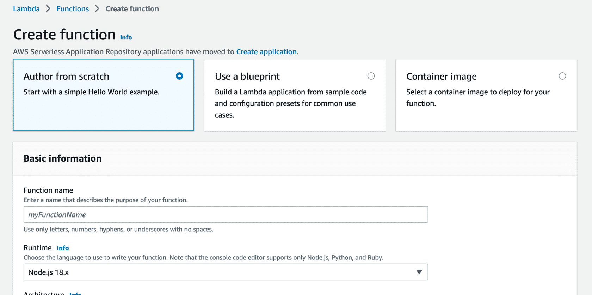

# Lambda Functions

AWS Lambda is a serveless service to run code.

Key concepts

## Function

A function is a resource that you can invoke to run your code in Lambda. Lambda runs instances of your function to process events. When you create the Lambda function, it can be authored in several ways:

- You can create the function from scratch.
- You can use a blueprint that AWS provides.
- You can select a container image to deploy for your function.
- You can browse the AWS Serverless Application Repository.
- You can author a Lambda function from scratch, by using a blueprint or selecting a container image.



## Trigger

Triggers describe when a Lambda function should run. A trigger integrates your Lambda function with other AWS services and event source mappings. So you can run your Lambda function in response to certain API calls or by reading items from a stream or queue. This increases your ability to respond to events in your console without having to perform manual actions.

## Event

An event is a JSON-formatted document that contains data for a Lambda function to process. The runtime converts the event to an object and passes it to your function code. When you invoke a function, you determine the structure and contents of the event.

## Application Environment

An application environment provides a secure and isolated runtime environment for your Lambda function. An application environment manages the processes and resources that are required to run the function.

## Deployment package

You deploy your Lambda function code using a deployment package. Lambda supports two types of deployment packages:

- __A .zip file archive__ – This contains your function code and its dependencies. Lambda provides the operating system and runtime for your function.

- __A container image__ – This is compatible with the Open Container Initiative (OCI) specification. You add your function code and dependencies to the image. You must also include the operating system and a Lambda runtime.

## Runtime

The runtime provides a language-specific environment that runs in an application environment. When you create your Lambda function, you specify the runtime that you want your code to run in. You can use built-in runtimes, such as Python, Node.js, Ruby, Go, Java, or .NET Core. Or you can implement your Lambda functions to run on a custom runtime.

## Lambda function handler

The AWS Lambda function handler is the method in your function code that processes events. When your function is invoked, Lambda runs the handler method. When the handler exits or returns a response, it becomes available to handle another event.

You can use the following general syntax when creating a function handler in Python.

```python
def handler_name (event, context):
...
return some_value
```
