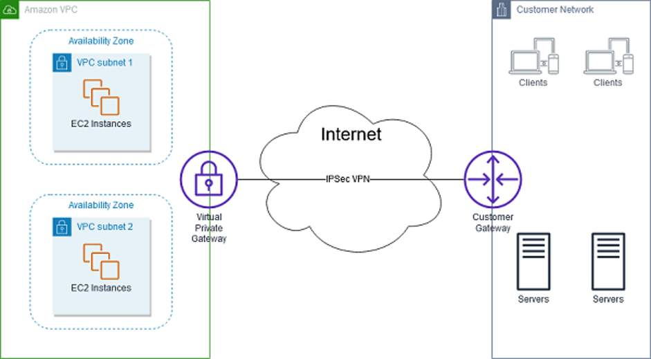

# Networking

CIDR notation 192.168.1.0/24 has less 256 ip addresses. It has less ip addressses than 192.168.1.0/16.

In AWS: the smallest IP range you can have is /28, which provides 16 IP addresses. The largest IP range you can have is a /16, which provides 65,536 IP addresses.

## VPC

VPC is the Amazon networking service.

AWS Lambda might not need VPC definition.

To maintain redundancy and fault tolerance, create at least two subnets configured in two Availability Zones.

To create a VPC:

- Choose a region,
- Indicate the IP range, expressed as a CIDR.
- Example: Oregon, 10.1.0.0/16

Create subnets to have segments that provide more granular control to resources. For instance, your database should reside on a more protected / private subnet.

## Subnets

To create a subnet:

- Choose a VPC
- Indicate the AZ
- Indicate the IP range, that must be contained by the VPC's own IP range.
- Examples:
  - "Public" subnet, 10.1.1.0/24    (256 addresses, for an EC2 instance), us-west-2a
  - "Private" subnet, 10.1.3.0/24    (256 addresses, for an RDS DB instance), us-west-2a

## Gateways

### Internet Gateway

Allows a VPC reach internet.

You create an IGW and then attach it to your VPC.

IGW is highly avaiable and escalable.

### Virtual Private Gateway

VGW allows to connect VPC to another private network (e.g. on-premises data center), via an encrypted VPN.

When you create and attach a virtual private gateway to a VPC, the gateway acts as anchor on the AWS side of the connection. On the other side of the connection, you will need to connect a customer gateway to the other private network. A customer gateway device is a physical device or software application on your side of the connection. When you have both gateways, you can then establish an encrypted virtual private network (VPN) connection between the two sides.

### AWS Direct Connect

To establish a secure physical connection between your on-premises data center and your Amazon VPC, you can use AWS Direct Connect. With AWS Direct Connect, your internal network is linked to an AWS Direct Connect location over a standard Ethernet fiber-optic cable. This connection allows you to create virtual interfaces directly to public AWS services or to your VPC.

## High Availability

- Examples:
  - Started with AZ A:
    - "Public" subnet, 10.1.1.0/24    (256 addresses, for an EC2 instance), us-west-2a
    - "Private" subnet, 10.1.3.0/24    (256 addresses, for an RDS DB instance), us-west-2a
  - Then added AZ B:
    - "Public" subnet, 10.1.2.0/24    (256 addresses, for an EC2 instance), us-west-2b
    - "Private" subnet, 10.1.4.0/24    (256 addresses, for an RDS DB instance), us-west-2b

All 4 subnets pertain to just one VPC: 10.1.0.0/16

## Reserved IPs

For AWS to configure your VPC appropriately, AWS reserves five IP addresses in each subnet. These IP addresses are used for routing, Domain Name System (DNS), and network management.

For example, consider a VPC with the IP range 10.0.0.0/22. The VPC includes 1,024 total IP addresses. This is then divided into four equal-sized subnets, each with a /24 IP range with 256 IP addresses. Out of each of those IP ranges, there are only 251 IP addresses that can be used because AWS reserves five.

The five reserved IP addresses can impact how you design your network. A common starting place for those who are new to the cloud is to create a VPC with an IP range of /16 and create subnets with an IP range of /24. This provides a large amount of IP addresses to work with at both the VPC and subnet levels.

What is reserved:

- 10.0.0.0 Network Address
- 10.0.0.1 VPC local router
- 10.0.0.2 DNS server
- 10.0.0.3 Future use
- 10.0.3.255 Network broadcast address

