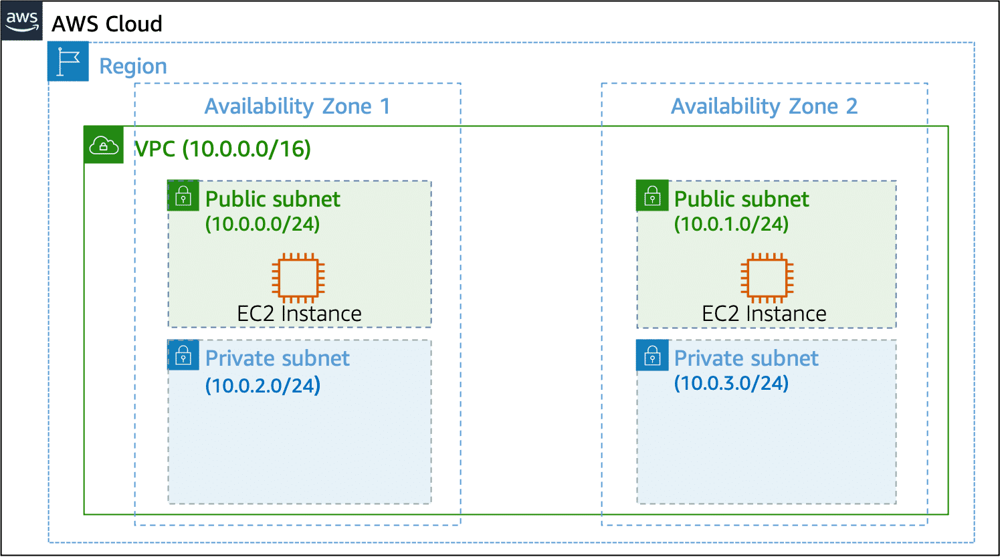

# Networking

CIDR notation 192.168.1.0/24 has less 256 ip addresses. It has less ip addressses than 192.168.1.0/16.

In AWS: the smallest IP range you can have is /28, which provides 16 IP addresses. The largest IP range you can have is a /16, which provides 65,536 IP addresses.

Remember:

- __Default Route Behavior:__

  - __ALLOWS__ all communication between subnets within the VPC
  - __DENIES__ all traffic to/from the internet (no internet gateway route)
  - __DENIES__ all traffic to external networks (no VPN/Direct Connect routes)

- __Default Network ACL__ for a subnet:
  - __ALLOWS__ all inbound traffic and
  - __ALLOWS__ all outbound traffic.
  - Stateful. Can state ALLOW or DENY rules.

- __Default Security Group__ for an EC2 instance:
  - __BLOCKS__ all inbound traffic
  - __ALLOWS__ all outbound traffic.
  - Stateful. No need to create an outbound rule. Only state ALLOW rules.

## VPC

VPC is the Amazon networking service.

AWS Lambda might not need VPC definition.

To maintain redundancy and fault tolerance, create at least two subnets configured in two Availability Zones.

To create a VPC:

- Choose a region,
- Indicate the IP range, expressed as a CIDR.
- Example: Oregon, 10.1.0.0/16

Create subnets to have segments that provide more granular control to resources. For instance, your database should reside on a more protected / private subnet.

## Subnets

To create a subnet:

- Choose a VPC
- Indicate the AZ
- Indicate the IP range, that must be contained by the VPC's own IP range.
- Examples:
  - "Public" subnet, 10.1.1.0/24    (256 addresses, for an EC2 instance), us-west-2a
  - "Private" subnet, 10.1.3.0/24    (256 addresses, for an RDS DB instance), us-west-2a

## Gateways

### Internet Gateway

Allows a VPC reach internet.

You create an IGW and then attach it to your VPC.

IGW is highly avaiable and escalable.

### Virtual Private Gateway

VGW allows to connect VPC to another private network (e.g. on-premises data center), via an encrypted VPN.

When you create and attach a virtual private gateway to a VPC, the gateway acts as anchor on the AWS side of the connection. On the other side of the connection, you will need to connect a customer gateway to the other private network. A customer gateway device is a physical device or software application on your side of the connection. When you have both gateways, you can then establish an encrypted virtual private network (VPN) connection between the two sides.

### AWS Direct Connect

To establish a secure physical connection between your on-premises data center and your Amazon VPC, you can use AWS Direct Connect. With AWS Direct Connect, your internal network is linked to an AWS Direct Connect location over a standard Ethernet fiber-optic cable. This connection allows you to create virtual interfaces directly to public AWS services or to your VPC.

## High Availability

- Examples:
  - Started with AZ A:
    - "Public" subnet, 10.1.1.0/24    (256 addresses, for an EC2 instance), us-west-2a
    - "Private" subnet, 10.1.3.0/24    (256 addresses, for an RDS DB instance), us-west-2a
  - Then added AZ B:
    - "Public" subnet, 10.1.2.0/24    (256 addresses, for an EC2 instance), us-west-2b
    - "Private" subnet, 10.1.4.0/24    (256 addresses, for an RDS DB instance), us-west-2b

All 4 subnets pertain to just one VPC: 10.1.0.0/16

## Reserved IPs

For AWS to configure your VPC appropriately, AWS reserves five IP addresses in each subnet. These IP addresses are used for routing, Domain Name System (DNS), and network management.

For example, consider a VPC with the IP range 10.0.0.0/22, which includes 1,024 total IP addresses. This is then divided into four equal-sized subnets, each with a /24 IP range with 256 IP addresses. Out of each of those IP ranges, there are only 251 IP addresses that can be used because AWS reserves five.

The five reserved IP addresses can impact how you design your network. A common starting place for those who are new to the cloud is to create a VPC with an IP range of /16 and create subnets with an IP range of /24. This provides a large amount of IP addresses to work with at both the VPC and subnet levels.

What is reserved:

- 10.0.0.0 Network Address
- 10.0.0.1 VPC local router
- 10.0.0.2 DNS server
- 10.0.0.3 Future use
- 10.0.3.255 Network broadcast address

## VPC Routing

A route table contains a set of rules, called routes, that determine where network traffic from your subnet or gateway is directed.

### Main route table

A route table contains a set of rules, called routes, that are used to determine where network traffic is directed.

When you create a VPC, AWS creates a route table called the main route table. AWS assumes that when you create a new VPC with subnets, you want traffic to flow between them. Therefore, the default configuration of the main route table is to allow traffic between all subnets in the local network. The following rules apply to the main route table:

- You cannot delete the main route table.
- You cannot set a gateway route table as the main route table.
- You can replace the main route table with a custom subnet route table.
- You can add, remove, and modify routes in the main route table.
- You can explicitly associate a subnet with the main route table, even if it's already implicitly associated.

The rule on the main route table looks like:

|Destination|Target|Action|
|-|-|-|
|10.1.0.0/16|local|__ALLOWS__ all traffic within VPC|

__Default Route Behavior:__

- __ALLOWS__: All communication between subnets within the VPC
- __DENIES__: All traffic to/from the internet (no internet gateway route)
- __DENIES__: All traffic to external networks (no VPN/Direct Connect routes)

This rule will be in every route table you create for the VPC.

Your VPC has an implicit router, and you use route tables to control where network traffic is directed. Each subnet in your VPC must be associated with a route table, which controls the routing for the subnet (subnet route table). You can explicitly associate a subnet with a particular route table. Otherwise, the subnet is implicitly associated with the main route table. A subnet can only be associated with one route table at a time, but you can associate multiple subnets with the same subnet route table.

### Custom route tables

The main route table is used implicitly by subnets that do not have an explicit route table association. However, you might want to provide different routes on a per-subnet basis for traffic to access resources outside of the VPC. For example, your application might consist of a frontend and a database. You can create separate subnets for the resources and provide different routes for each of them.

If you associate a subnet with a custom route table, the subnet will use it instead of the main route table. Each custom route table that you create will have the local route already inside it, allowing communication to flow between all resources and subnets inside the VPC. You can protect your VPC by explicitly associating each new subnet with a custom route table and leaving the main route table in its original default state.

What makes a public subnet public, is that the custom route table has a route to the IGW.

|Destination|Target|
|-|-|
|10.1.0.0/16|local|
|0.0.0.0/0|igw-xxxyyyyzzz|

By default, a route table contains a local route for communication within the VPC. If you Create a VPC and choose a public subnet, Amazon VPC creates a custom route table and adds a route that points to the internet gateway. One way to protect your VPC is to leave the main route table in its original default state. Then, explicitly associate each new subnet that you create with one of the custom route tables you've created. This ensures that you explicitly control how each subnet routes traffic.

You can add, remove, and modify routes in a custom route table. You can delete a custom route table only if it has no associations.

When you replace the default route table (let's say A) with a custom routing table (B) explicit, do it step-by-step so you can test the change.
Consider this scenarios with subnets A and B:

0. Original state: both subnets implicitly use route table A as the default routing table.
1. Create an explicit association between subnet B and route table B. Test route table B.
2. Make route table B the main route table.
3. Current state: Subnet B explicity uses table B. Subnet A implicitly uses route table A.
4. You could now:

- Explicitly associate subnet A with route table B
- Or remove the explicit association between subnet B and route table B, so everything is implicit.
- Delete route table A, since no subnet is using it.

Good design rule: explicit associations are good, because if you change the default then you are sure what is the targeted audience.

### Routing rules

- CIDR blocks for IPv4 and IPv6 are treated separately. For example, a route with a destination CIDR of 0.0.0.0/0 does not automatically include all IPv6 addresses. You must create a route with a destination CIDR of ::/0 for all IPv6 addresses.

- If you frequently reference the same set of CIDR blocks across your AWS resources, you can create a customer-managed _prefix list_ to group them together. You can then specify the prefix list as the destination in your route table entry.

- Every route table contains a local route for communication within the VPC. This route is added by default to all route tables. If your VPC has more than one IPv4 CIDR block, your route tables contain a local route for each IPv4 CIDR block. If you've associated an IPv6 CIDR block with your VPC, your route tables contain a local route for the IPv6 CIDR block. You can replace or restore the target of each local route as needed.

- You can add a route to your route tables that is more specific than the local route. The destination must match the entire IPv4 or IPv6 CIDR block of a subnet in your VPC. The target must be a NAT gateway, network interface, or Gateway Load Balancer endpoint.

- If your route table has multiple routes, we use the most specific route that matches the traffic (longest prefix match) to determine how to route the traffic.

- You can't add routes to IPv4 addresses that are an exact match or a subset of the following range: 169.254.168.0/22. This range is within the link-local address space and is reserved for use by AWS services. For example, Amazon EC2 uses addresses in this range for services that are accessible only from EC2 instances, such as the Instance Metadata Service (IMDS) and the Amazon DNS server. You can use a CIDR block that is larger than but overlaps 169.254.168.0/22, but packets destined for addresses in 169.254.168.0/22 will not be forwarded.

- You can't add routes to IPv6 addresses that are an exact match or a subset of the following range: fd00:ec2::/32. This range is within the unique local address (ULA) space and is reserved for use by AWS services. For example, Amazon EC2 uses addresses in this range for services that are accessible only from EC2 instances, such as the Instance Metadata Service (IMDS) and the Amazon DNS server. You can use a CIDR block that is larger than but overlaps fd00:ec2::/32, but packets destined for addresses in fd00:ec2::/32 will not be forwarded.
dd

## VPC Security

Use Network ACLs and Security Groups.

### Network ACLs

Think of a network access control list (network ACL) as a virtual firewall at the subnet level. A network ACL lets you control what kind of traffic is allowed to enter or leave your subnet. You can configure this by setting up rules that define what you want to filter. Here is an example of a default ACL for a VPC that supports IPv4.

Network ACLs are stateless. You need to add inbound and outbound rules for the same protocol.

Example of a default network ACL.

However, you might want to restrict data at the subnet level. For example, if you have a web application, you might restrict your network to allow HTTPS traffic and Remote Desktop Protocol (RDP) traffic to your web servers.

Notice that in the custom network ACL in the preceding example, you allow inbound 443 and outbound range 1025–65535. That’s because HTTPS uses port 443 to initiate a connection and will respond to an ephemeral port. Network ACLs are considered stateless, so you need to include both the inbound and outbound ports used for the protocol. If you don’t include the outbound range, your server would respond but the traffic would never leave the subnet.

Because network ACLs are configured by default to allow incoming and outgoing traffic, you don’t need to change their initial settings unless you need additional security layers.

### Security Groups

A security group is a firewall, defined at the instance level.

The default configuration of a security group blocks all inbound traffic and allows all outbound traffic.

Security group is stateful. No need to add outbound rule.

Use Security Groups for fine grained access control:

This example defines three tiers and isolates each tier with defined security group rules. In this case, internet traffic to the web tier is allowed over HTTPS. Web tier to application tier traffic is allowed over HTTP, and application tier to database tier traffic is allowed over MySQL. This is different from traditional on-premises environments, in which you isolate groups of resources with a VLAN configuration. In AWS, security groups allow you to achieve the same isolation without tying the security groups to your network.

## Notes

1:1 relationship between VPC and Internet Gateway.

The Security Group resides exclusively on a VPC.
