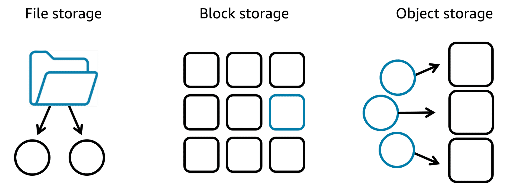
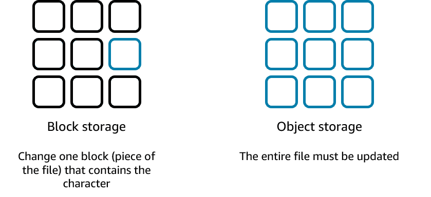
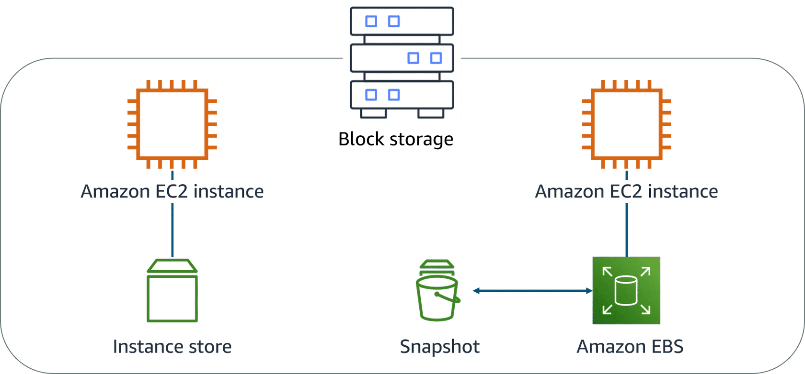
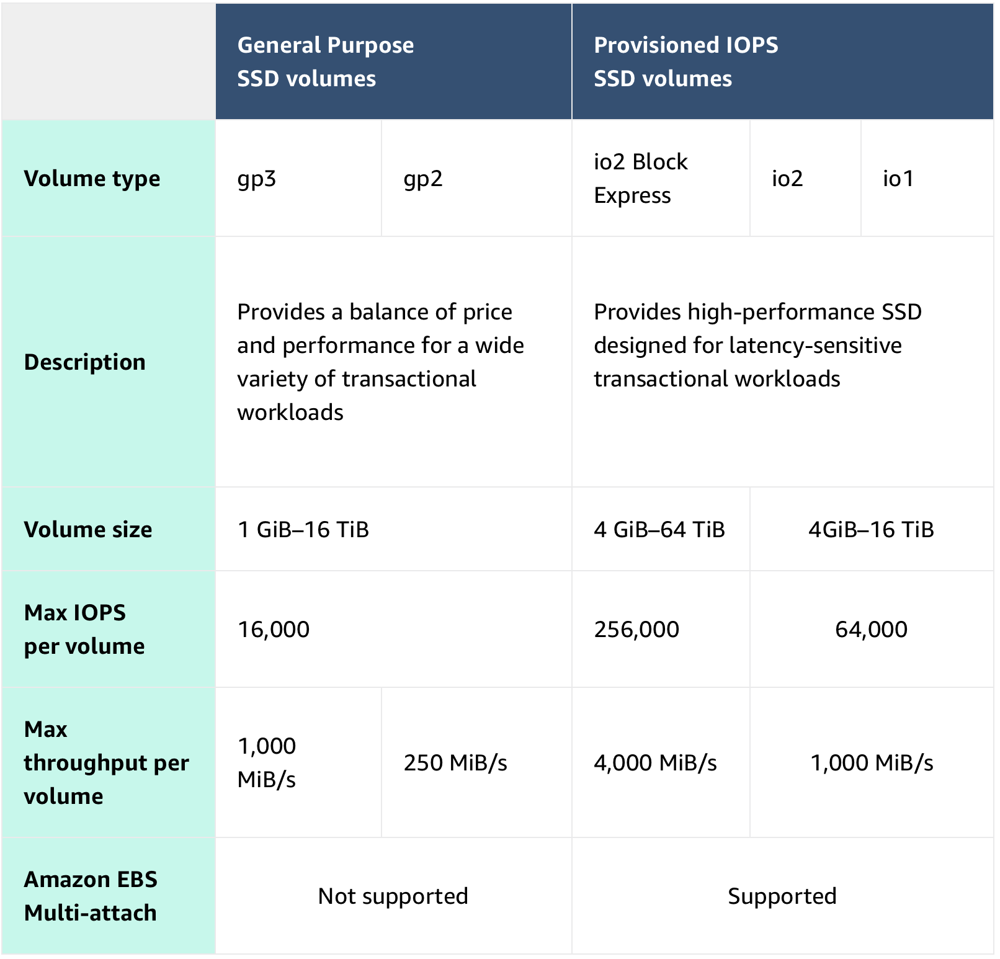
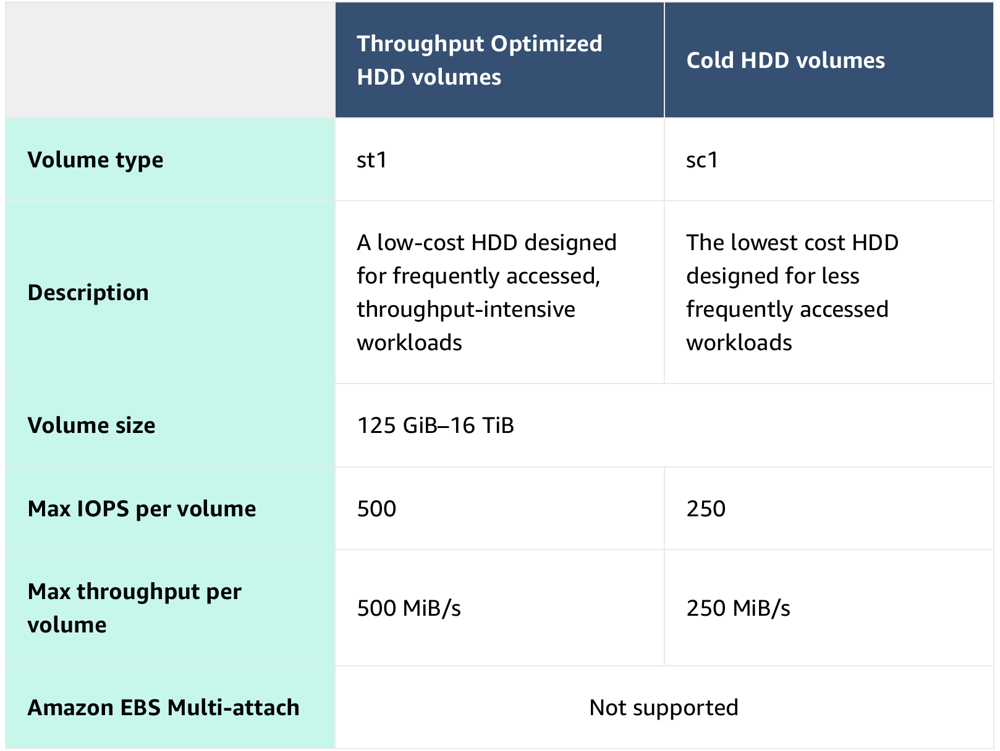
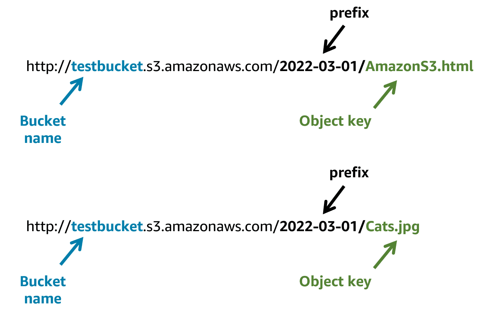
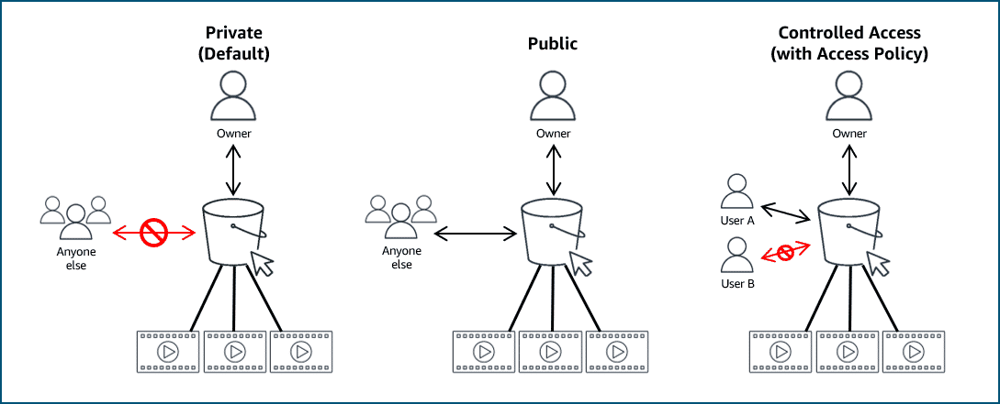
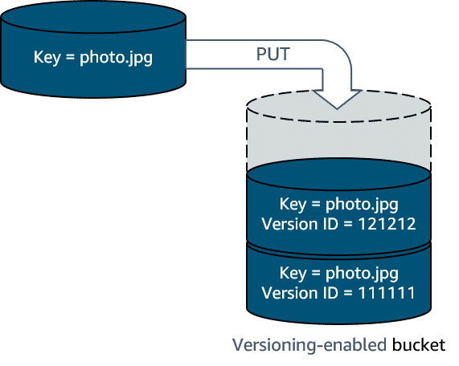

# Storage

AWS storage services are grouped into three categories: file storage, block storage, and object storage. In file storage, data is stored as files in a hierarchy. In block storage, data is stored in fixed-size blocks. And in object storage, data is stored as objects in buckets.

## Introduction

### File Storage

Each file has metadata such as file name, file size, and the date the file was created. The file also has a path, for example, computer/Application_files/Cat_photos/cats-03.png. When you need to retrieve a file, your system can use the path to find it in the file hierarchy.

File storage is ideal when you require centralized access to files that must be easily shared and managed by multiple host computers. Typically, this storage is mounted onto multiple hosts, and requires file locking and integration with existing file system communication protocols.

Use cases:

- __Web serving__

    Cloud file storage solutions follow common file-level protocols, file naming conventions, and permissions that developers are familiar with. Therefore, file storage can be integrated into web applications.

- __Analytics__

    Many analytics workloads interact with data through a file interface and rely on features such as file lock or writing to portions of a file. Cloud-based file storage supports common file-level protocols and has the ability to scale capacity and performance. Therefore, file storage can be conveniently integrated into analytics workflows.

- __Media and entertainment__

    Many businesses use a hybrid cloud deployment and need standardized access using file system protocols (NFS or SMB) or concurrent protocol access. Cloud file storage follows existing file system semantics. Therefore, storage of rich media content for processing and collaboration can be integrated for content production, digital supply chains, media streaming, broadcast playout, analytics, and archive.

- Home directories

    Businesses wanting to take advantage of the scalability and cost benefits of the cloud are extending access to home directories for many of their users. Cloud file storage systems adhere to common file-level protocols and standard permissions models. Therefore, customers can lift and shift applications that need this capability to the cloud.

File storage systems are often supported with a network-attached storage (NAS) server.

### Block Storage

File storage treats files as a singular unit, but block storage splits files into fixed-size chunks of data called blocks that have their own addresses. Each block is an individual piece of data storage. Because each block is addressable, blocks can be retrieved efficiently. Think of block storage as a more direct route to access the data.

When data is requested, the addresses are used by the storage system to organize the blocks in the correct order to form a complete file to present back to the requestor. Besides the address, no additional metadata is associated with each block.

If you want to change one character in a file, you just change the block, or the piece of the file, that contains the character. This ease of access is why block storage solutions are fast and use less bandwidth.

Because block storage is optimized for low-latency operations, it is a preferred storage choice for high-performance enterprise workloads and transactional, mission-critical, and I/O-intensive applications.

Use cases:

- __Transactional workloads__

    Organizations that process time-sensitive and mission-critical transactions store such workloads into a low-latency, high-capacity, and fault-tolerant database. Block storage allows developers to set up a robust, scalable, and highly efficient transactional database. Because each block is a self-contained unit, the database performs optimally, even when the stored data grows.

- __Containers__

    Developers use block storage to store containerized applications on the cloud. Containers are software packages that contain the application and its resource files for deployment in any computing environment. Like containers, block storage is equally flexible, scalable, and efficient. With block storage, developers can migrate the containers seamlessly between servers, locations, and operating environments.

- __Virtual machines__

    Block storage supports popular virtual machine (VM) hypervisors. Users can install the operating system, file system, and other computing resources on a block storage volume. They do so by formatting the block storage volume and turning it into a VM file system. So they can readily increase or decrease the virtual drive size and transfer the virtualized storage from one host to another.

Block storage in the cloud is analogous to direct-attached storage (DAS) or a storage area network (SAN).

### Object storage

In object storage, files are stored as objects. Objects, much like files, are treated as a single, distinct unit of data when stored. However, unlike file storage, these objects are stored in a bucket using a flat structure, meaning there are no folders, directories, or complex hierarchies. Each object contains a unique identifier. This identifier, along with any additional metadata, is bundled with the data and stored.

Changing just one character in an object is more difficult than with block storage. When you want to change one character in an object, the entire object must be updated.

With object storage, you can store almost any type of data, and there is no limit to the number of objects stored, which makes it readily scalable. Object storage is generally useful when storing large or unstructured data sets.

Use cases:

- __Data archiving__

    Cloud object storage is excellent for long-term data retention. You can cost-effectively archive large amounts of rich media content and retain mandated regulatory data for extended periods of time. You can also use cloud object storage to replace on-premises tape and disk archive infrastructure. This storage solution provides enhanced data durability, immediate retrieval times, better security and compliance, and greater data accessibility.

- __Backup and recovery__

    You can configure object storage systems to replicate content so that if a physical device fails, duplicate object storage devices become available. This ensures that your systems and applications continue to run without interruption. You can also replicate data across multiple data centers and geographical regions.

- __Rich media__

    With object storage, you can accelerate applications and reduce the cost of storing rich media files such as videos, digital images, and music. By using storage classes and replication features, you can create cost-effective, globally replicated architecture to deliver media to distributed users.

## File Storage with Amazon EFS and Amazon FSx

Use a range of cloud storage solutions to readily move to managed file storage without changes to your applications or workflows.

### Amazon Elastic File System (Amazon EFS)

{ style="display:block;margin:0 auto;" }

Amazon Elastic File System (Amazon EFS) is a set-and-forget file system that automatically grows and shrinks as you add and remove files. There is no need for provisioning or managing storage capacity and performance. Amazon EFS can be used with AWS compute services and on-premises resources. You can connect tens, hundreds, and even thousands of compute instances to an Amazon EFS file system at the same time, and Amazon EFS can provide consistent performance to each compute instance.

With the Amazon EFS simple web interface, you can create and configure file systems quickly without any minimum fee or setup cost. You pay only for the storage used and you can choose from a range of storage classes designed to fit your use case.

|Standard storage classes| One zone storage classes
|-|-
|EFS Standard and EFS Standard-Infrequent Access (Standard-IA) offer Multi-AZ resilience and the highest levels of durability and availability.  |EFS One Zone and EFS One Zone-Infrequent Access (EFS One Zone-IA) provide additional savings by saving your data in a single availability zone.

### Amazon FSx

Amazon FSx is a fully managed service that offers reliability, security, scalability, and a broad set of capabilities that make it convenient and cost effective to launch, run, and scale high-performance file systems in the cloud. With Amazon FSx, you can choose between four widely used file systems: Lustre, NetApp ONTAP, OpenZFS, and Windows File Server. You can choose based on your familiarity with a file system or based on your workload requirements for feature sets, performance profiles, and data management capabilities.

### Amazon FSx for NetApp ONTAP

Amazon FSx for NetApp ONTAP is a fully managed service. It combines the familiar features, performance, capabilities, and API operations of on-premises NetApp file systems with the agility, scalability, and simplicity of a fully managed AWS service. FSx for ONTAP can serve as a drop-in replacement for existing ONTAP deployments, giving customers the ability to launch and run ONTAP file systems in the cloud.  

FSx for ONTAP provides rich data management features and flexible shared file storage that are broadly accessible from Linux, Windows, and macOS compute instances running in AWS or on premises.

{ width=25% style="display:block;margin:0 auto;" }

### Amazon FSx for OpenZFS

Amazon FSx for OpenZFS is a fully managed file storage service that helps you to move data residing in on-premises ZFS or other Linux-based file servers to AWS without changing your application code or how you manage data. With FSx for OpenZFS, you no longer have to worry about setting up and provisioning files servers and storage volumes. You also don't have to deal with replicating data, installing and patching file server software, detecting and addressing hardware failures, or manually performing backups.

FSx for OpenZFS delivers leading performance for latency-sensitive and small-file workloads with popular NAS data management capabilities (snapshots, and cloning), at a lower price than commercially licensed alternatives.

{ width=25% style="display:block;margin:0 auto;" }

### Amazon FSx for Windows File Server

Amazon FSx for Windows File Server provides fully managed, highly reliable and scalable Microsoft Windows file servers, backed by a fully native Windows file system. FSx for Windows File Server provides file storage that is accessible over the Service Message Block (SMB) protocol and has the ability to serve as a drop-in replacement for existing Windows file server deployments.

As a fully managed service, FSx for Windows File Server removes the administrative tasks of setting up and provisioning file servers and storage volumes and provides ease of use for customers building and running Windows applications.

{ width=25% style="display:block;margin:0 auto;" }

### Amazon FSx for Lustre

The open-source Lustre file system is designed for applications that require fast storage, where you want your storage to keep up with your compute. Amazon FSx for Lustre makes it convenient and cost effective to launch, run, and scale the popular high-performance file system. You can link FSx for Lustre file systems to data repositories on Amazon Simple Storage Service (Amazon S3) or to on-premises data stores.

FSx for Lustre delivers the highest levels of throughput (up to 1+ TB/s) and IOPS (millions). Customers can seamlessly integrate, access, and process their Amazon S3 datasets using the Lustre high-performance file system.

## Amazon EC2 instance store

Amazon Elastic Compute Cloud (Amazon EC2) instance store provides temporary block-level storage for an instance. This storage is located on disks that are physically attached to the host computer. This ties the lifecycle of the data to the lifecycle of the EC2 instance. If you delete the instance, the instance store is also deleted. Because of this, instance store is considered ephemeral storage.

Instance store is ideal if you host applications that replicate data to other EC2 instances, such as Hadoop clusters. For these cluster-based workloads, having the speed of locally attached volumes and the resiliency of replicated data helps you achieve data distribution at high performance. It’s also ideal for temporary storage of information that changes frequently, such as buffers, caches, scratch data, and other temporary content.

## Amazon EBS

Amazon Elastic Block Store (Amazon EBS) is block-level storage that you can attach to an Amazon EC2 instance.

- __Detachable__: You can detach an EBS volume from one EC2 instance and attach it to another EC2 instance in the same Availability Zone to access the data on it.

- __Distinct__: EBS volumes are separate from the computer. That means that if an accident occurs and the computer goes down, you still have your data on your EBS volumes

- __Size-limited__: Amazon EBS volumes have max limitation of how much content you can store on it.

- __1-to-1 connection__: Most EBS volumes have a one-to-one relationship with EC2 instances, so they cannot be shared by or attached to multiple instances at one time. In opposition, Amazon EBS multi-attach feature that permits Provisioned IOPS SSD (io1 or io2) volumes to be attached to multiple EC2 instances at one time. This feature is not available for all instance types, and all instances must be in the same Availability Zone.

### Scaling Amazon EBS Volumes

Two methods:

#### Increase the volume size

Increase the volume size only if it doesn’t increase above the maximum size limit. Depending on the volume selected, Amazon EBS currently supports a maximum volume size of 64 tebibytes (TiB). For example, if you provision a 5-TiB io2 Block Express volume, you can choose to increase the size of your volume until you get to 64 TiB.

#### Attach multiple volumes

Attach multiple volumes to a single EC2 instance. Amazon EC2 has a one-to-many relationship with EBS volumes. You can add these additional volumes during or after EC2 instance creation to provide more storage capacity for your hosts.

### Amazon EBS use cases

- __Operating systems__

Boot and root volumes can be used to store an operating system. The root device for an instance launched from an Amazon Machine Image (AMI) is typically an EBS volume. These are commonly referred to as EBS-backed AMIs.

- __Databases__

As a storage layer for databases running on Amazon EC2 that will scale with your performance needs and provide consistent and low-latency performance.

- __Enterprise applications__

Amazon EBS provides high availability and high durability block storage to run business-critical applications.

- __Big data analytics engines__

Amazon EBS offers data persistence, dynamic performance adjustments, and the ability to detach and reattach volumes, so you can resize clusters for big data analytics.

### EBS volume types

EBS volumes are organized into two main categories: solid-state drives (SSDs) and hard-disk drives (HDDs). SSDs are used for transactional workloads with frequent read/write operations with small I/O size. HDDs are used for large streaming workloads that need high throughput performance.  AWS offers two types of each.

#### SSD volumes

#### HHD volumes

### EBS Benefits

- __High Availability__: When you create an EBS volume, it is automatically replicated in its Availability Zone to prevent data loss from single points of failure.

- __Data persistence__: Storage persists even when your instance doesn’t.

- __Data encryption__: When activated by the user, all EBS volumes support encryption.

- __Flexibility__: EBS volumes support on-the-fly changes. Modify volume type, volume size, and input/output operations per second (IOPS) capacity without stopping your instance.

- __Backups__: Amazon EBS provides the ability to create backups of any EBS volume.

### Amazon EBS snapshots

Backups of volumes are called snapshots.

EBS snapshots are incremental backups that only save the blocks on the volume that have changed after your most recent snapshot. For example, if you have 10 GB of data on a volume and only 2 GB of data have been modified since your last snapshot, only the 2 GB that have been changed are written to Amazon S3.

When you take a snapshot of any of your EBS volumes, the backups are stored redundantly in multiple Availability Zones using Amazon S3. This aspect of storing the backup in Amazon S3 is handled by AWS, so you won’t need to interact with Amazon S3 to work with your EBS snapshots. You manage them in the Amazon EBS console, which is part of the Amazon EC2 console.

EBS snapshots can be used to create multiple new volumes, whether they’re in the same Availability Zone or a different one. When you create a new volume from a snapshot, it’s an exact copy of the original volume at the time the snapshot was taken.

## Object Storage with Amazon S3

S3 = Simple Storage Service

Object storage is built for the cloud and delivers virtually unlimited scalability, high durability, and cost effectiveness.

You can have directories.

Policies on buckets or ACL's on objects let you control access. More granular access is avaible through IAM.

Amazon S3 is an object storage service. Object storage stores data in a flat structure. An object is a file combined with metadata. You can store as many of these objects as you want. All the characteristics of object storage are also characteristics of Amazon S3.

In Amazon S3, you store your objects in containers called buckets. You can’t upload an object, not even a single photo, to Amazon S3 without creating a bucket first. When you store an object in a bucket, the combination of a bucket name, key, and version ID uniquely identifies the object.

### Amazon S3 bucket names

Amazon S3 supports global buckets. Therefore, each bucket name must be unique across all AWS accounts in all AWS Regions within a partition. A partition is a grouping of Regions, of which AWS currently has three: Standard Regions, China Regions, and AWS GovCloud (US). When naming a bucket, choose a name that is relevant to you or your business. For example, you should avoid using AWS or Amazon in your bucket name.

The following are some examples of the rules that apply for naming buckets in Amazon S3.

- Bucket names must be between 3 (min) and 63 (max) characters long.
- Bucket names can consist only of lowercase letters, numbers, dots (.), and hyphens (-).
- Bucket names must begin and end with a letter or number.
- Buckets must not be formatted as an IP address.
- A bucket name cannot be used by another AWS account in the same partition until the bucket is deleted.
- If your application automatically creates buckets, choose a bucket naming scheme that is unlikely to cause naming conflicts and will choose a different bucket name, should one not be available.

### Object key names

The object key (key name) uniquely identifies the object in an Amazon S3 bucket. When you create an object, you specify the key name. As described earlier, the Amazon S3 model is a flat structure, meaning there is no hierarchy of subbuckets or subfolders. However, the Amazon S3 console does support the concept of folders. By using key name prefixes and delimiters, you can imply a logical hierarchy.  

For example, suppose your bucket called testbucket has two objects with the following object keys: 2022-03-01/AmazonS3.html and 2022-03-01/Cats.jpg. The console uses the key name prefix, 2022-03-01, and delimiter (/) to present a folder structure.

### Amazon S3 use cases

- __Backup and storage__

    Amazon S3 is a natural place to back up files because it is highly redundant. As mentioned in the last lesson, AWS stores your EBS snapshots in Amazon S3 to take advantage of its high availability.

- __Media hosting__

    Because you can store unlimited objects, and each individual object can be up to 5 TB, Amazon S3 is an ideal location to host video, photo, and music uploads.

- __Software delivery__

    You can use Amazon S3 to host your software applications that customers can download.

- __Data lakes__

    Amazon S3 is an optimal foundation for a data lake because of its virtually unlimited scalability. You can increase storage from gigabytes to petabytes of content, paying only for what you use.

- __Static websites__

    You can configure your S3 bucket to host a static website of HTML, CSS, and client-side scripts.

- __Static content__

    Because of the limitless scaling, the support for large files, and the fact that you can access any object over the web at any time, Amazon S3 is the perfect place to store static content.

### Security in Amazon S3

Everything in Amazon S3 is private by default. This means that all Amazon S3 resources, such as buckets and objects, can only be viewed by the user or AWS account that created that resource. Amazon S3 resources are all private and protected to begin with.

If you decide that you want everyone on the internet to see your photos, you can choose to make your buckets and objects public. A public resource means that everyone on the internet can see it. Most of the time, you don’t want your permissions to be all or nothing. Typically, you want to be more granular about the way that you provide access to your resources.

To be more specific about who can do what with your Amazon S3 resources, Amazon S3 provides several security management features: IAM policies, S3 bucket policies, and encryption to develop and implement your own security policies.

### Amazon S3 and IAM policies

When IAM policies are attached to your resources (buckets and objects) or IAM users, groups, and roles, the policies define which actions they can perform. Access policies that you attach to your resources are referred to as _resource-based policies_ and access policies attached to users in your account are called _user policies_.

You should use IAM policies for private buckets in the following two scenarios:

- You have many buckets with different permission requirements. Instead of defining many different S3 bucket policies, you can use IAM policies.

- You want all policies to be in a centralized location. By using IAM policies, you can manage all policy information in one location.

### Amazon S3 bucket policies

Like IAM policies, S3 bucket policies are defined in a JSON format. Unlike IAM policies, which are attached to resources and users, S3 bucket policies can only be attached to S3 buckets. The policy that is placed on the bucket applies to every object in that bucket. S3 bucket policies specify what actions are allowed or denied on the bucket.

You should use S3 bucket policies in the following scenarios:

- You need a simple way to do cross-account access to Amazon S3, without using IAM roles.

- Your IAM policies bump up against the defined size limit. S3 bucket policies have a larger size limit.

### Amazon S3 encryption

Amazon S3 reinforces encryption in transit (as it travels to and from Amazon S3) and at rest. To protect data, Amazon S3 automatically encrypts all objects on upload and applies server-side encryption with S3-managed keys as the base level of encryption for every bucket in Amazon S3 at no additional cost.

### Amazon S3 storage classes

| Storage Class | Description
|-|-
| S3 Standard | This is considered general-purpose storage for cloud applications, dynamic websites, content distribution, mobile and gaming applications, and big data analytics.
| S3 Intelligent-Tiering | This tier is useful if your data has unknown or changing access patters. S3 Intelligent-Tiering stores objects in three tiers: a frequent access tier, an infrequent access tier, and an archive instance access tier. Amazon S3 monitors access patterns of your data and automatically moves your data to the most cost-effective storage tier based on frequency of access.
| S3 Standard-Infrequent Access (S3 Standard-IA) | This tier is for data that is accessed less frequently but requires rapid access when needed. S3 Standard-IA offers the high durability, high throughput, and low latency of S3 Standard, with a low per-GB storage price and per-GB retrieval fee. This storage tier is ideal if you want to store long-term backups, disaster recovery files, and so on.
| S3 One Zone-Infrequent Access (S3 One Zone-IA) | Unlike other S3 storage classes that store data in a minimum of three Availability Zones, S3 One Zone-IA stores data in a single Availability Zone, which makes it less expensive than S3 Standard-IA. S3 One Zone-IA is ideal for customers who want a lower-cost option for infrequently accessed data, but do not require the availability and resilience of S3 Standard or S3 Standard-IA. It's a good choice for storing secondary backup copies of on-premises data or easily recreatable data.
| S3 Glacier Instant Retrieval | Use S3 Glacier Instant Retrieval for archiving data that is rarely accessed and requires millisecond retrieval. Data stored in this storage class offers a cost savings of up to 68 percent compared to the S3 Standard-IA storage class, with the same latency and throughput performance.
| S3 Glacier Flexible Retrieval | S3 Glacier Flexible Retrieval offers low-cost storage for archived data that is accessed 1–2 times per year. With S3 Glacier Flexible Retrieval, your data can be accessed in as little as 1–5 minutes using an expedited retrieval. You can also request free bulk retrievals in up to 5–12 hours. It is an ideal solution for backup, disaster recovery, offsite data storage needs, and for when some data occasionally must be retrieved in minutes.
| S3 Glacier Deep Archive | S3 Glacier Deep Archive is the lowest-cost Amazon S3 storage class. It supports long-term retention and digital preservation for data that might be accessed once or twice a year. Data stored in the S3 Glacier Deep Archive storage class has a default retrieval time of 12 hours. It is designed for customers that retain data sets for 7–10 years or longer, to meet regulatory compliance requirements. Examples include those in highly regulated industries, such as the financial services, healthcare, and public sectors.
| S3 on Outposts | Amazon S3 on Outposts delivers object storage to your on-premises AWS Outposts environment using S3 API's and features. For workloads that require satisfying local data residency requirements or need to keep data close to on premises applications for performance reasons, the S3 Outposts storage class is the ideal option.

### Amazon S3 versioning

As described earlier, Amazon S3 identifies objects in part by using the object name. For example, when you upload an employee photo to Amazon S3, you might name the object employee.jpg and store it in a bucket called employees. Without Amazon S3 versioning, every time you upload an object called employee.jpg to the employees bucket, it will overwrite the original object.
This can be an issue for several reasons, including the following:

- __Common names__: The employee.jpg object name is a common name for an employee photo object. You or someone else who has access to the bucket might not have intended to overwrite it; but once it's overwritten, the original object can't be accessed.

- __Version preservation__: You might want to preserve different versions of employee.jpg. Without versioning, if you wanted to create a new version of employee.jpg, you would need to upload the object and choose a different name for it. Having several objects all with slight differences in naming variations can cause confusion and clutter in S3 buckets.

To counteract these issues, you can use Amazon S3 versioning. Versioning keeps multiple versions of a single object in the same bucket. This preserves old versions of an object without using different names, which helps with object recovery from accidental deletions, accidental overwrites, or application failures.

