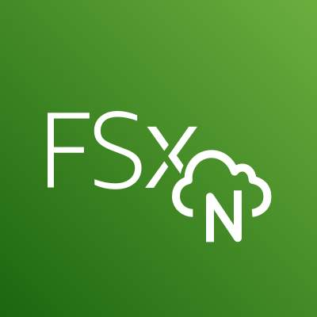
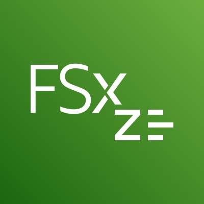

# Storage

AWS storage services are grouped into three categories: file storage, block storage, and object storage. In file storage, data is stored as files in a hierarchy. In block storage, data is stored in fixed-size blocks. And in object storage, data is stored as objects in buckets.

## Introduction

### File Storage

Each file has metadata such as file name, file size, and the date the file was created. The file also has a path, for example, computer/Application_files/Cat_photos/cats-03.png. When you need to retrieve a file, your system can use the path to find it in the file hierarchy.

File storage is ideal when you require centralized access to files that must be easily shared and managed by multiple host computers. Typically, this storage is mounted onto multiple hosts, and requires file locking and integration with existing file system communication protocols.

Use cases:

- __Web serving__

    Cloud file storage solutions follow common file-level protocols, file naming conventions, and permissions that developers are familiar with. Therefore, file storage can be integrated into web applications.

- __Analytics__

    Many analytics workloads interact with data through a file interface and rely on features such as file lock or writing to portions of a file. Cloud-based file storage supports common file-level protocols and has the ability to scale capacity and performance. Therefore, file storage can be conveniently integrated into analytics workflows.

- __Media and entertainment__

    Many businesses use a hybrid cloud deployment and need standardized access using file system protocols (NFS or SMB) or concurrent protocol access. Cloud file storage follows existing file system semantics. Therefore, storage of rich media content for processing and collaboration can be integrated for content production, digital supply chains, media streaming, broadcast playout, analytics, and archive.

- Home directories

    Businesses wanting to take advantage of the scalability and cost benefits of the cloud are extending access to home directories for many of their users. Cloud file storage systems adhere to common file-level protocols and standard permissions models. Therefore, customers can lift and shift applications that need this capability to the cloud.

File storage systems are often supported with a network-attached storage (NAS) server.

### Block Storage

File storage treats files as a singular unit, but block storage splits files into fixed-size chunks of data called blocks that have their own addresses. Each block is an individual piece of data storage. Because each block is addressable, blocks can be retrieved efficiently. Think of block storage as a more direct route to access the data.

When data is requested, the addresses are used by the storage system to organize the blocks in the correct order to form a complete file to present back to the requestor. Besides the address, no additional metadata is associated with each block.

If you want to change one character in a file, you just change the block, or the piece of the file, that contains the character. This ease of access is why block storage solutions are fast and use less bandwidth.

Because block storage is optimized for low-latency operations, it is a preferred storage choice for high-performance enterprise workloads and transactional, mission-critical, and I/O-intensive applications.

Use cases:

- __Transactional workloads__

    Organizations that process time-sensitive and mission-critical transactions store such workloads into a low-latency, high-capacity, and fault-tolerant database. Block storage allows developers to set up a robust, scalable, and highly efficient transactional database. Because each block is a self-contained unit, the database performs optimally, even when the stored data grows.

- __Containers__

    Developers use block storage to store containerized applications on the cloud. Containers are software packages that contain the application and its resource files for deployment in any computing environment. Like containers, block storage is equally flexible, scalable, and efficient. With block storage, developers can migrate the containers seamlessly between servers, locations, and operating environments.

- __Virtual machines__

    Block storage supports popular virtual machine (VM) hypervisors. Users can install the operating system, file system, and other computing resources on a block storage volume. They do so by formatting the block storage volume and turning it into a VM file system. So they can readily increase or decrease the virtual drive size and transfer the virtualized storage from one host to another.

Block storage in the cloud is analogous to direct-attached storage (DAS) or a storage area network (SAN).

### Object storage

In object storage, files are stored as objects. Objects, much like files, are treated as a single, distinct unit of data when stored. However, unlike file storage, these objects are stored in a bucket using a flat structure, meaning there are no folders, directories, or complex hierarchies. Each object contains a unique identifier. This identifier, along with any additional metadata, is bundled with the data and stored.

Changing just one character in an object is more difficult than with block storage. When you want to change one character in an object, the entire object must be updated.

With object storage, you can store almost any type of data, and there is no limit to the number of objects stored, which makes it readily scalable. Object storage is generally useful when storing large or unstructured data sets.

Use cases:

- __Data archiving__

    Cloud object storage is excellent for long-term data retention. You can cost-effectively archive large amounts of rich media content and retain mandated regulatory data for extended periods of time. You can also use cloud object storage to replace on-premises tape and disk archive infrastructure. This storage solution provides enhanced data durability, immediate retrieval times, better security and compliance, and greater data accessibility.

- __Backup and recovery__

    You can configure object storage systems to replicate content so that if a physical device fails, duplicate object storage devices become available. This ensures that your systems and applications continue to run without interruption. You can also replicate data across multiple data centers and geographical regions.

- __Rich media__

    With object storage, you can accelerate applications and reduce the cost of storing rich media files such as videos, digital images, and music. By using storage classes and replication features, you can create cost-effective, globally replicated architecture to deliver media to distributed users.

## File Storage with Amazon EFS and Amazon FSx

Use a range of cloud storage solutions to readily move to managed file storage without changes to your applications or workflows.

### Amazon Elastic File System (Amazon EFS)

Amazon Elastic File System (Amazon EFS) is a set-and-forget file system that automatically grows and shrinks as you add and remove files. There is no need for provisioning or managing storage capacity and performance. Amazon EFS can be used with AWS compute services and on-premises resources. You can connect tens, hundreds, and even thousands of compute instances to an Amazon EFS file system at the same time, and Amazon EFS can provide consistent performance to each compute instance.

With the Amazon EFS simple web interface, you can create and configure file systems quickly without any minimum fee or setup cost. You pay only for the storage used and you can choose from a range of storage classes designed to fit your use case.

|Standard storage classes| One zone storage classes
|-|-
|EFS Standard and EFS Standard-Infrequent Access (Standard-IA) offer Multi-AZ resilience and the highest levels of durability and availability.  |EFS One Zone and EFS One Zone-Infrequent Access (EFS One Zone-IA) provide additional savings by saving your data in a single availability zone.

### Amazon FSx

Amazon FSx is a fully managed service that offers reliability, security, scalability, and a broad set of capabilities that make it convenient and cost effective to launch, run, and scale high-performance file systems in the cloud. With Amazon FSx, you can choose between four widely used file systems: Lustre, NetApp ONTAP, OpenZFS, and Windows File Server. You can choose based on your familiarity with a file system or based on your workload requirements for feature sets, performance profiles, and data management capabilities.

### Amazon FSx for NetApp ONTAP

Amazon FSx for NetApp ONTAP is a fully managed service. It combines the familiar features, performance, capabilities, and API operations of on-premises NetApp file systems with the agility, scalability, and simplicity of a fully managed AWS service. FSx for ONTAP can serve as a drop-in replacement for existing ONTAP deployments, giving customers the ability to launch and run ONTAP file systems in the cloud.  

FSx for ONTAP provides rich data management features and flexible shared file storage that are broadly accessible from Linux, Windows, and macOS compute instances running in AWS or on premises.

### Amazon FSx for OpenZFS

Amazon FSx for OpenZFS is a fully managed file storage service that helps you to move data residing in on-premises ZFS or other Linux-based file servers to AWS without changing your application code or how you manage data. With FSx for OpenZFS, you no longer have to worry about setting up and provisioning files servers and storage volumes. You also don't have to deal with replicating data, installing and patching file server software, detecting and addressing hardware failures, or manually performing backups.

FSx for OpenZFS delivers leading performance for latency-sensitive and small-file workloads with popular NAS data management capabilities (snapshots, and cloning), at a lower price than commercially licensed alternatives.

### Amazon FSx for Windows File Server

Amazon FSx for Windows File Server provides fully managed, highly reliable and scalable Microsoft Windows file servers, backed by a fully native Windows file system. FSx for Windows File Server provides file storage that is accessible over the Service Message Block (SMB) protocol and has the ability to serve as a drop-in replacement for existing Windows file server deployments.

As a fully managed service, FSx for Windows File Server removes the administrative tasks of setting up and provisioning file servers and storage volumes and provides ease of use for customers building and running Windows applications.

### Amazon FSx for Lustre

The open-source Lustre file system is designed for applications that require fast storage, where you want your storage to keep up with your compute. Amazon FSx for Lustre makes it convenient and cost effective to launch, run, and scale the popular high-performance file system. You can link FSx for Lustre file systems to data repositories on Amazon Simple Storage Service (Amazon S3) or to on-premises data stores.

FSx for Lustre delivers the highest levels of throughput (up to 1+ TB/s) and IOPS (millions). Customers can seamlessly integrate, access, and process their Amazon S3 datasets using the Lustre high-performance file system.

