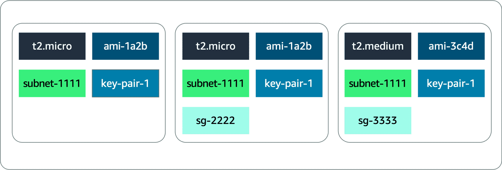

# Amazon EC2 Auto Scaling

ASG stands for auto-scaling group.

Amazon EC2 Auto Scaling helps you maintain application availability. You can automatically add or remove EC2 instances using scaling policies that you define.

## Capacity issues

You can improve availability and reachability by adding one more server. However, the entire system can again become unavailable if there is a capacity issue. This section looks at load issues for both active-passive systems and active-active systems. These issues are addressed through scaling.

### Vertical scaling

Increase the instance size. If too many requests are sent to a single active-passive system, the active server will become unavailable and, hopefully, fail over to the passive server. But this doesn’t solve anything.

With active-passive systems, you need vertical scaling. This means increasing the size of the server. With EC2 instances, you select either a larger type or a different instance type. This can be done only while the instance is in a stopped state. In this scenario, the following steps occur:

1. __Stop the passive instance__. This doesn’t impact the application because it’s not taking any traffic.

1. __Change the instance size or type__, and then start the instance again.

1. __Shift the traffic__ to the passive instance, turning it active.

1. __Stop, change the size, and start__ the previous active instance because both instances should match.

When the number of requests reduces, you must do the same operation. Even though there aren’t that many steps involved, it’s actually a lot of manual work. Another disadvantage is that a server can only scale vertically up to a certain limit. When that limit is reached, the only option is to create another active-passive system and split the requests and functionalities across them. This can require massive application rewriting.

This is where the active-active system can help. When there are too many requests, you can scale this system horizontally by adding more servers.

### Horizontal scaling

__Add additional instances__. As mentioned, for the application to work in an active-active system, it’s already created as stateless, not storing any client sessions on the server. This means that having two or four servers wouldn’t require any application changes. It would only be a matter of creating more instances when required and shutting them down when traffic decreases. The Amazon EC2 Auto Scaling service can take care of that task by automatically creating and removing EC2 instances based on metrics from Amazon CloudWatch. We will learn more about this service in this lesson.

You can see that there are many more advantages to using an active-active system in comparison with an active-passive system. Modifying your application to become stateless provides scalability.

### Traditional scaling compared to auto scaling

With a traditional approach to scaling, you buy and provision enough servers to handle traffic at its peak. However, this means at nighttime, for example, you might have more capacity than traffic, which means you’re wasting money. Turning off your servers at night or at times when the traffic is lower only saves on electricity.

The cloud works differently with a pay-as-you-go model. You must turn off the unused services, especially EC2 instances you pay for on-demand. You can manually add and remove servers at a predicted time. But with unusual spikes in traffic, this solution leads to a waste of resources with over-provisioning or a loss of customers because of under-provisioning.

The need here is for a tool that automatically adds and removes EC2 instances according to conditions you define. That’s exactly what the Amazon EC2 Auto Scaling service does.

### Amazon EC2 Auto Scaling features

The Amazon EC2 Auto Scaling service adds and removes capacity to keep a steady and predictable performance at the lowest possible cost. By adjusting the capacity to exactly what your application uses, you only pay for what your application needs. This means Amazon EC2 Auto Scaling helps scale your infrastructure and ensure high availability.

- __Automatic scaling__: Automatically scales in and out based on demand.

- __Scheduled scaling__: Scales based on user-defined schedules.

- __Fleet management__: Automatically replaces unhealthy EC2 instances.

- __Predictive scaling__: Uses machine learning (ML) to help schedule the optimum number of EC2 instances.

- __Purchase options__: Includes multiple purchase models, instance types, and Availability Zones.

- __Amazon EC2 availability__: Comes with the Amazon EC2 service.

### ELB with Amazon EC2 Auto Scaling

Additionally, the ELB service integrates seamlessly with Amazon EC2 Auto Scaling. As soon as a new EC2 instance is added to or removed from the Amazon EC2 Auto Scaling group, ELB is notified. However, before ELB can send traffic to a new EC2 instance, it needs to validate that the application running on the EC2 instance is available.

This validation is done by way of the ELB health checks feature you learned about in the previous lesson. 

## Configure Amazon EC2 Auto Scaling components

There are three main components of Amazon EC2 Auto Scaling. Each of these components addresses one main question as follows:

- __Launch template or configuration__: *Which* resources should be automatically scaled?

- __Amazon EC2 Auto Scaling groups__: *Where* should the resources be deployed?

- __Scaling policies__: *When* should the resources be added or removed?

### Launch templates and configurations

Multiple parameters are required to create EC2 instances—Amazon Machine Image (AMI) ID, instance type, security group, additional Amazon EBS volumes, and more. All this information is also required by Amazon EC2 Auto Scaling to create the EC2 instance on your behalf when there is a need to scale. This information is stored in a launch template.

You can use a launch template to manually launch an EC2 instance or for use with Amazon EC2 Auto Scaling. It also supports versioning, which can be used for quickly rolling back if there's an issue or a need to specify a default version of the template. This way, while iterating on a new version, other users can continue launching EC2 instances using the default version until you make the necessary changes.

A launch template specifies instance configuration information, such as the ID of the AMI, instance type, and security groups. You can have multiple versions of a launch template with a subset of the full parameters.

You can create a launch template in one of three ways as follows:

- Use an existing EC2 instance. All the settings are already defined.

- Create one from an already existing template or a previous version of a launch template.

- Create a template from scratch. These parameters will need to be defined: AMI ID, instance type, key pair, security group, storage, and resource tags.

Another way to define what Amazon EC2 Auto Scaling needs to scale is by using a launch configuration. It’s similar to the launch template, but you cannot use a previously created launch configuration as a template. You cannot create a launch configuration from an existing Amazon EC2 instance. For these reasons, and to ensure that you get the latest features from Amazon EC2, AWS recommends you use a launch template instead of a launch configuration.

### Amazon EC2 Auto Scaling groups (ASG)

The next component Amazon EC2 Auto Scaling needs is an Amazon EC2 Auto Scaling group. An Auto Scaling group helps you define where Amazon EC2 Auto Scaling deploys your resources. This is where you specify the Amazon Virtual Private Cloud (Amazon VPC) and subnets the EC2 instance should be launched in. Amazon EC2 Auto Scaling takes care of creating the EC2 instances across the subnets, so select at least two subnets that are across different Availability Zones.

With Auto Scaling groups, you can specify the type of purchase for the EC2 instances. You can use On-Demand Instances or Spot Instances. You can also use a combination of the two, which means you can take advantage of Spot Instances with minimal administrative overhead.

To specify how many instances Amazon EC2 Auto Scaling should launch, you have three capacity settings to configure for the group size.

- __Minimum capacity__

    This is the minimum number of instances running in your Auto Scaling group, even if the threshold for lowering the number of instances is reached.

    When Amazon EC2 Auto Scaling removes EC2 instances because the traffic is minimal, it keeps removing EC2 instances until it reaches a minimum capacity.

    When reaching that limit, even if Amazon EC2 Auto Scaling is instructed to remove an instance, it does not. This ensures that the minimum is kept.

    Note: Depending on your application, using a minimum of two is recommended to ensure high availability. However, you ultimately know how many EC2 instances at a bare minimum your application requires at all times.

- __Desired capacity__

    The desired capacity is the number of EC2 instances that Amazon EC2 Auto Scaling creates at the time the group is created. This number can only be within or equal to the minimum or maximum.

    If that number decreases, Amazon EC2 Auto Scaling removes the oldest instance by default. If that number increases, Amazon EC2 Auto Scaling creates new instances using the launch template.

- __Maximum capacity__

    This is the maximum number of instances running in your Auto Scaling group, even if the threshold for adding new instances is reached.

    When traffic keeps growing, Amazon EC2 Auto Scaling keeps adding EC2 instances. This means the cost for your application will also keep growing. That’s why you must set a maximum amount to ensure it doesn’t go above your budget.

### Scaling policies

By default, an Auto Scaling group will be kept to its initial desired capacity. While it’s possible to manually change the desired capacity, you can also use scaling policies.

In the Monitoring lesson, you learned about CloudWatch metrics and alarms. You use metrics to keep information about different attributes of your EC2 instance, such as the CPU percentage. You use alarms to specify an action when a threshold is reached. Metrics and alarms are what scaling policies use to know when to act. For example, you can set up an alarm that states when the CPU utilization is above 70 percent across the entire fleet of EC2 instances. It will then invoke a scaling policy to add an EC2 instance.

Three types of scaling policies are available: simple, step, and target tracking scaling. To learn about a category, choose the appropriate tab.

- __SIMPLE SCALING POLICY__

    With a simple scaling policy, you can do exactly what’s described in this module. You use a CloudWatch alarm and specify what to do when it is invoked. This can include adding or removing a number of EC2 instances or specifying a number of instances to set the desired capacity to. You can specify a percentage of the group instead of using a number of EC2 instances, which makes the group grow or shrink more quickly.

    After the scaling policy is invoked, it enters a cooldown period before taking any other action. This is important because it takes time for the EC2 instances to start, and the CloudWatch alarm might still be invoked while the EC2 instance is booting. For example, you might decide to add an EC2 instance if the CPU utilization across all instances is above 65 percent. You don’t want to add more instances until that new EC2 instance is accepting traffic. However, what if the CPU utilization is now above 85 percent across the Auto Scaling group?

    Adding one instance might not be the right move. Instead, you might want to add another step in your scaling policy. Unfortunately, a simple scaling policy can’t help with that. This is where a step scaling policy helps.

- __STEP SCALING POLICY__

    Step scaling policies respond to additional alarms even when a scaling activity or health check replacement is in progress. Similar to the previous example, you might decide to add two more instances when CPU utilization is at 85 percent and four more instances when it’s at 95 percent.

    Deciding when to add and remove instances based on CloudWatch alarms might seem like a difficult task. This is why the third type of scaling policy exists—target tracking.

- __TARGET TRACKING SCALING POLICY__

    If your application scales based on average CPU utilization, average network utilization (in or out), or request count, then this scaling policy type is the one to use. All you need to provide is the target value to track, and it automatically creates the required CloudWatch alarms.
