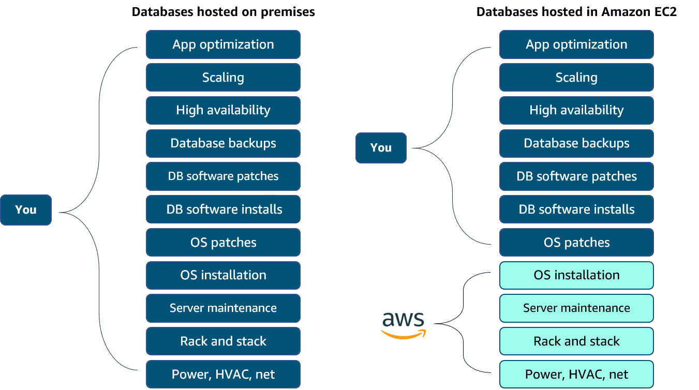

# Databases on AWS

## Introduction

### Relational databases

#### Benefits

- __Complex SQL__: Use SQL to join multiple tables so you can better understand relationships between your data.

- __Reduced redundancy__: You can store data in one table and reference it from other tables instead of saving the same data in different places. (Leo's note: Normal Forms)

- __Familiarity__: Because relational databases have been a popular choice since the 1970s, technical professionals often have familiarity and experience with them.

- __Accuracy__: Relational databases ensure that your data has high integrity and adheres to the atomicity, consistency, isolation, and durability (ACID) principle. (Leo's note: There's a relational model that holds semantics.)

#### Use cases

- __Applications that have a fixed schema__:

    These are applications that have a fixed schema and don't change often. An example is a lift-and-shift application that lifts an app from on-premises and shifts it to the cloud, with little or no modifications.

- __Applications that need persistent storage__

    These are applications that need persistent storage and follow the ACID principle, such as:
      - Enterprise resource planning (ERP) applications
      - Customer relationship management (CRM) applications
      - Commerce and financial applications

#### Managed vs Unmanaged

Managed compared to unmanaged can be understood as a trade-off between convenience and control.

To shift more of the work to AWS, you can use a managed database service. These services provide the setup of both the EC2 instance and the database, and they provide systems for high availability, scalability, patching, and backups. However, in this model, you’re still responsible for database tuning, query optimization, and ensuring that your customer data is secure. This option provides the ultimate convenience but the least amount of control compared to the two previous options.

### Database Instances

The compute portion is called database instance.

- __Standard classes__: (includes m classes)

  Standard instances provide a balance of compute, memory, and network resources. They are a good choice for many database workloads.

- __Memory optimized classes__: (includes r and x classes)

Memory optimized instances accelerate performance for workloads that process large datasets in memory.

- __Burstable classes__: (includes t classes)

Burstable performance instances provide a baseline level of CPU performance with the ability to burst above the baseline.

### Storage on Amazon RDS

The storage portion of DB instances for Amazon RDS use Amazon Elastic Block Store (Amazon EBS) volumes for database and log storage. This includes MySQL, MariaDB, PostgreSQL, Oracle, and SQL Server.

When using Aurora, data is stored in cluster volumes, which are single, virtual volumes that use solid-state drives (SSDs). A cluster volume contains copies of your data across three Availability Zones in a single AWS Region. For nonpersistent, temporary files, Aurora uses local storage.

Amazon RDS provides three storage types: General Purpose SSD (also called gp2 and gp3), Provisioned IOPS SSD (also called io1), and Magnetic (also called standard). They differ in performance characteristics and price, which means you can tailor your storage performance and cost to the needs of your database workload.

- __General Purpose SSD__

    These volumes offer cost-effective storage. This is ideal for a broad range of workloads running on medium-sized DB instances. General Purpose storage is best suited for development and testing environments.

- __Provisioned IOPS SSD__

    This type of storage is designed to meet the needs of I/O-intensive workloads. For example, database workloads requiring low I/O latency and consistent I/O throughput. Provisioned IOPS storage is best suited for production environments.

- __Magnetic__

    Amazon RDS also supports magnetic storage for backward compatibility. We recommend that you use General Purpose SSD or Provisioned IOPS SSD for any new storage needs. The maximum amount of storage for DB instances on magnetic storage is less than that of the other storage types.

### Amazon RDS in an Amazon Virtual Private Cloud

When you create a DB instance, you select the Amazon Virtual Private Cloud (Amazon VPC) your databases will live in. Then, you select the subnets that will be designated for your DB. This is called a DB subnet group, and it has at least two Availability Zones in its Region. The subnets in a DB subnet group should be private, so they don’t have a route to the internet gateway. This ensures that your DB instance, and the data inside it, can be reached only by the application backend.

Access to the DB instance can be restricted further by using network access control lists (network ACLs) and security groups. With these firewalls, you can control, at a granular level, the type of traffic you want to provide access into your database.

Using these controls provides layers of security for your infrastructure. It reinforces that only the backend instances have access to the database.

### Backups

- __Automated backups__

    Automated backups are turned on by default. This backs up your entire DB instance (not just individual databases on the instance) and your transaction logs. When you create your DB instance, you set a backup window that is the period of time that automatic backups occur. Typically, you want to set the window during a time when your database experiences little activity because it can cause increased latency and downtime.

    Retaining backups: Automated backups are retained between 0 and 35 days. You might ask yourself, “Why set automated backups for 0 days?” The 0 days setting stops automated backups from happening. If you set it to 0, it will also delete all existing automated backups. This is not ideal. The benefit of automated backups that you can do point-in-time recovery.

    Point-in-time recovery: This creates a new DB instance using data restored from a specific point in time. This restoration method provides more granularity by restoring the full backup and rolling back transactions up to the specified time range.

- __Manual snapshots__

    If you want to keep your automated backups longer than 35 days, use manual snapshots. Manual snapshots are similar to taking Amazon EBS snapshots, except you manage them in the Amazon RDS console. These are backups that you can initiate at any time. They exist until you delete them. For example, to meet a compliance requirement that mandates you to keep database backups for a year, you need to use manual snapshots. If you restore data from a manual snapshot, it creates a new DB instance using the data from the snapshot.

It is advisable to deploy both backup options. Automated backups are beneficial for point-in-time recovery. With manual snapshots, you can retain backups for longer than 35 days.

### Redundancy with Amazon RDS Multi-AZ

In an Amazon RDS Multi-AZ deployment, Amazon RDS creates a redundant copy of your database in another Availability Zone. You end up with two copies of your database—a primary copy in a subnet in one Availability Zone and a standby copy in a subnet in a second Availability Zone.

The primary copy of your database provides access to your data so that applications can query and display the information. The data in the primary copy is synchronously replicated to the standby copy. The standby copy is not considered an active database, and it does not get queried by applications.
Diagram depicting Amazon RDS Multi-AZ creating a redundant copy of a database in another Availability Zone.
To improve availability, Amazon RDS Multi-AZ ensures that you have two copies of your database running and that one of them is in the primary role. If an availability issue arises, such as the primary database loses connectivity, Amazon RDS initiates an automatic failover.
When you create a DB instance, a Domain Name System (DNS) name is provided. AWS uses that DNS name to fail over to the standby database. In an automatic failover, the standby database is promoted to the primary role, and queries are redirected to the new primary database.

To help ensure that you don't lose Multi-AZ configuration, there are two ways you can create a new standby database. They are as follows:

Demote the previous primary to standby if it's still up and running.
Stand up a new standby DB instance.
The reason you can select multiple subnets for an Amazon RDS database is because of the Multi-AZ configuration. You will want to ensure that you have subnets in different Availability Zones for your primary and standby copies.

### Amazon RDS security

When it comes to security in Amazon RDS, you have control over managing access to your Amazon RDS resources, such as your databases on a DB instance. How you manage access will depend on the tasks you or other users need to perform in Amazon RDS. Network ACLs and security groups help users dictate the flow of traffic. If you want to restrict the actions and resources others can access, you can use AWS Identity and Access Management (IAM) policies.

- __IAM__

    Use IAM policies to assign permissions that determine who can manage Amazon RDS resources. For example, you can use IAM to determine who can create, describe, modify, and delete DB instances, tag resources, or modify security groups

- __Security Groups__

    Use security groups to control which IP addresses or Amazon EC2 instances can connect to your databases on a DB instance. When you first create a DB instance, all database access is prevented except through rules specified by an associated security group.

- __Amazon RDS encryption__

    Use Amazon RDS encryption to secure your DB instances and snapshots at rest.

- __SSL or TLS__

    Use Secure Sockets Layer (SSL) or Transport Layer Security (TLS) connections with DB instances running the MySQL, MariaDB, PostgreSQL, Oracle, or SQL Server database engines.

- ____

