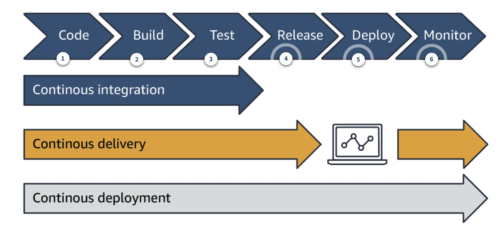

# DevOps

DevOps is the combination of cultural philosophies, practices, and tools that increases an organization’s ability to deliver applications and services at high velocity: evolving and improving products at a faster pace than organizations using traditional software development and infrastructure management processes. This speed enables organizations to better serve their customers and compete more effectively in the market.

DevOps emphasizes better collaboration and efficiencies so teams can innovate faster and deliver higher value to businesses and customers.

DevOps is a combination of:

- Cultural philosophies for removing barriers and sharing end-to-end responsibility
- Processes developed for speed and quality, that streamline the way people work
- Tools that align with processes and automate repeatable tasks, making the release process more efficient and the application more reliable

## Problems of traditional development practices

- __Waterfall development projects__ are slow, not iterative, resistant to change, and have long release cycles. Some reasons for this include:

  - Requirements are rigid, set at project start, and will likely not change.

  - Development phases are siloed, each starting after the previous phase has ended. Each phase is supported by highly specialized teams.

  - Hand offs from one phase to the other are long, often requiring teams to switch tools and spend time clarifying incomplete or ambiguous information.

  - Testing and security come after implementation, making corrective actions responsive and expensive.

- __Monolithic applications__ are hard to update and deploy because they:

    Are developed and deployed as a unit, so when changes are made, the entire application must be redeployed
    Have tightly coupled functionality, so if the application is large enough, maintenance becomes an issue because developers have a hard time understanding the entire application
    Are implemented using a single development stack, so changing technology is difficult and costly

- __Manual processes__ throughout the application lifecycle are slow, inconsistent, and error-prone. For example, manually setting and configuring the infrastructure is time-consuming. Manually repeating this process is no guarantee that a step will not be missed. Another example is telling the developers to make sure their code is thoroughly tested before pushing it. Even with the best intentions, this manual process is slow, and does not preclude someone from forgetting a test or two.

- __Siloed teams__. Teams supporting the software development lifecycle have traditionally been siloed. Specialized in their skill set, teams such as business, development, quality assurance, specialists, maintenance, and operations, have been separated from each other and require scheduled and rigid hand-offs. Even though these teams have a common goal of delivering and supporting the application, they also have their own priorities, tooling, and processes. It is difficult to achieve efficiencies when project members are reporting to different units and aimed for different targets.

## Benefits of DevOps

- 106x Faster commit to deploy
- 208x More frequent deployments
- 7x Lower change failure rate
- 2604x Faster time to recover

- __Agility__: enabled by development practices, monitoring tools, controls at delivery, small updates

- __Rapid delivery__: core priciples of DevOps are continuous integration and continuous delivery, rapid feedback loop and continuous monitoring. Automation supports Agile.

- __Reliability__: CI/CD can test every change is functional and safe. Monitoring tools to provid feedback.

- __Scale__: Tools are applied to one or many instances. The tools automated manual tasks and can scale.

- __Improved collaboration__: Build more effective teams under a DevOps cultural model, which emphasizes values such as ownership and accountability. Developers and operations teams collaborate closely, share many responsibilities, and combine their workflows. This reduces innefficiencies and saves time. For example, writing code that takes into account the environment in which it is run, reduces handover periods between developers and operations.

- __Security__: The DevOps model uses automatic enforcement rules, fine-grained controls, and configuration management techniques that help to move quickly while retaining leveratge and ensuring compliance policies.
    For example, you can describe and then monitor enforcement at scale, using infrastructure as code and policy as code.

Be aware of:

- Bottlenecks cause by less resources:
  - When creating specifications
  - When reviewing

- Culture, that follows process but permits
  - Wrong test description, that allow
  - Minimal tests
  - Minimal ratio of change

## DevOps methodology

### Objectives

- Discuss the challenges involved in adopting a DevOps culture and describe possible solutions.
- Identify automation opportunities in developing and maintaining applications.
- Describe the benefits of decoupling services or components.
- Define observability and describe its importance to DevOps.
- Explain why security is important in every phase of the pipeline.
- Explain how AWS integrates with third-party tools for automated code delivery and deployments

A shift to DevOps requires creating and nurturing a DevOps culture, which is a culture of transparency, effective and seamless collaboration, and common goals.

There are seven core principles that can help you achieve a DevOps culture.

1. __Create a highly collaborative environment__

    DevOps brings together development and operations to break down silos, align goals, and deliver on common objectives. The whole team (development, testing, security, operations, and others) has end-to-end ownership for the software they release. They work together to optimize the productivity of developers and the reliability of operations. Teams learn from each other's experiences, listen to concerns and perspectives, and streamline their processes to achieve the required results.

    This increased visibility enables processes to be unified and continuously improved to deliver on business goals. The collaboration also creates a high-trust culture that values the efforts of each team member, and transfers knowledge and best practices across teams and the organization.

1. __Automate when possible__

    With DevOps, repeatable tasks are automated, enabling teams to focus on innovation. Automation provides the means to rapid development, testing, and deployment. Identify automation opportunities at every phase, such as code integrations, reviews, testing, security, deployments, and monitoring, using the right tools and services.

    For example, infrastructure-as-code (IaC) can be used for predefined or approved environments, and versioned so that repeatable and consistent environments are built. You can also define regulatory checks and incorporate them in test that continuously run as part of your release pipeline.

1. __Focus on customer needs__

    A customer first mindset is a key factor in driving development. For example, with feedback loops DevOps teams stay in-touch with their customer and develop software that meets the customer needs. With a microservices architecture, they are able to quickly switch direction and align their efforts to those needs. 

    Streamlined processes and automation deliver requested updates faster and keep customer satisfaction high. Monitoring helps teams determine the success of their application and continuously align their customer focused efforts.

1. __Develop small and release often__

    Applications are no longer being developed as one monolithic system with rigid development, testing, and deployment practices. Application architectures are designed with smaller, loosely coupled components. Overarching policies (such as backward compatibility, or change management) are in place and provide governance to development efforts. Teams are organized to match the required system architecture. They have a sense of ownership for their efforts. 

    Adopting modern development practices, such as small and frequent code releases, gives teams the agility they need to be responsive to customer needs and business objectives.

1. __Include security at every phase__

    To support continuous delivery, security must be iterative, incremental, automated, and in every phase of the application lifecycle, instead of something that is done before a release. Educate the development and operations teams to embed security into each step of the application lifecycle. This way, you can identify and resolve potential vulnerabilities before they become major issues and are more expensive to fix. 

    For example, you can include security testing to scan for hard-coded access keys, or usage of restricted ports.

1. __Continuously experiment and learn__

    Inquiry, innovation, learning, and mentoring are encouraged and incorporated into DevOps processes. Teams are innovative and their progress is monitored. With innovation, failure will happen. Leadership accepts failure and teams are encouraged to see failure as a learning opportunity. 

    For example, teams use DevOps tools to spin-up environments on demand, enabling them to experiment and innovate, perhaps on the use of new technology to support a customer requirement.

1. __Continuously improve__

    Thoughtful metrics help teams monitor their progress, evaluate their processes and tools, and work toward common goals and continuous improvement. For example, teams strive to improve development performance measures such as throughput.

    They also strive to increase stability and reduce the mean time to restore service. Using the right monitoring tools, you can set application benchmarks for usual behaviors, and continuously monitor for variations.

There's a fallacy here:

1. Complex logic will require time to be implemented, regardless the methods.

## Practices

DevOps culture leads to DevOps practices that are geared toward streamlining and improving the development lifecycle, to reliably deliver frequent updates, while maintaining stability. 

- __Communication and collaboration__

    DevOps teams set strong cultural norms around transparency of information and communication. These cross-functional teams have ownership and thus, instead of evaluating just their work, they consider the project needs collectively. They build empathy for each other’s efforts, partnerships, and trust, while collaborating towards common goals. They physically bring together traditional development and operations workflows and systematically improve productivity. 

    DevOps tools and automation of the delivery process, support these consolidated processes and workflows, coordinate efforts, automate repetitive tasks, and facilitate feedback loops required in good communication and collaboration.

– __Monitoring and observability__

    Monitoring and observability are used to assess how effective changes to the application and infrastructure are, and how they impact performance and overall user experience. Part of DevOps feedback loops, monitoring and observability help teams react, learn, plan, and improve.

    An observable system is a system that generates enough data from all resources, applications, and services in the form of logs, metrics, and traces to gain system-wide operational visibility. Logs report on discrete events, such as warnings. Metrics capture health and performance information, such as request rate or response time. Traces report on transactions and the flow of data across a distributed system, such as one comprised of microservices. 

    By observing a system, you can draw concise inferences about why something is happening.

    Monitoring tells you what is happening with your system. By consolidating and visualizing data gathered by an observable system over time, teams gain insight on performance, identify trends, can set alarms, and make predictions on expected outcomes.

- __Continuous integration (CI)__

    Continuous integration is a DevOps software development practice where developers regularly merge their code changes into a central repository, after which automated builds and tests are run. This way, teams can resolve merging issues and code defects early, when they are easier and more cost effective to resolve.

    Continuous integration most often refers to the build or integration stage of the software release process. It requires both an automation component (for example, a CI or build service) and a cultural component (for example, learning to integrate frequently). The key goals of continuous integration are to find and address bugs quicker, improve software quality, and reduce the time it takes to validate and release new software updates.

- __Continuous delivery/continuous deployment (CD)__

    Continuous delivery is a software development practice where every code change is automatically built, tested, and then deployed to a non-production testing or staging environment. Manual approval is required before pushing to production. When properly implemented, developers will always have a deployment-ready build artifact that has passed through a standardized test process.

    Continuous deployment is similar to continuous delivery, but with automatic deployment to production. Tested code does not need an explicit approval before being pushed to production.

- __Microservices architecture__

    A microservices architecture, is a design approach that builds an application as a set of loosely coupled services. Each service is designed for a set of capabilities and focuses on solving a specific business problem. Services do not need to share any of their code or implementation with other services. Any communication between individual components happens via well-defined APIs. These services can be assigned to fully accountable teams, and be developed, tested, an deployed independently of other services.

    According to research from DevOps Research and Assessment (DORA), the type of architecture the team settles on, is a direct predictor of how successful they will be with achieving continuous delivery. The nature of microservices supports faster development, updates and corrections, and quicker deployments.

- __Infrastructure as code__

    Development, testing, and production run on complex environments comprised of hardware and software. Manually spinning up and setting environments does not scale and is error prone. 

    Infrastructure as code (IaC) is a practice in which infrastructure is provisioned and managed using code and software development techniques, such as version control and continuous integration.

    The cloud’s API-driven model enables developers and system administrators to interact with infrastructure programmatically, and at scale, instead of needing to manually set up and configure resources. Because environments are defined by code, they can quickly be deployed with dynamically enforced compliance, updated with the latest patches, rolled back to a previous version, or duplicated in repeatable ways. Also, by reacting to environment changes through modification to this code, you can track changes, optimize resources, and improve system uptime. 
    A DevOps pipeline is a set of stages that move code from source, all the way to deployment. The graphic that follows depicts typical stages in a DevOps pipeline and depicts the phases involved in a CI/CD pipeline.

A CI/CD pipeline is a good example of how DevOps teams use tools to streamline workflows and standardize practices. A CI/CD pipeline assures code quality, security, and fast, consistent deployments by repeatably progressing through the pipeline. DevOps teams iteratively remove process overlaps, human errors, and bottlenecks through automation.

Every DevOps team requires an efficient and reliable CI/CD pipeline. A CI/CD pipeline requires a well-integrated tool chain.

Lifecycle stages:

1. __Code__

    Devevelop code in languages such as java, .NET, or Python.
    When ready, deliver this code to a central location.
    Peers review the new code.

1. __Build__

    Creating builds of your software may include some of these actions:

    - Compile code
    - Check code styles and standards
    - Analyze code complexity and maintainability
    - Validate dependencies
    - Create container images
    - Run unit tests

1. __Test__

    Assess if the application meets the defined functional, performance, design, and implementation requirements.
    Some testing practices are:

    - Functional testing
    - Integration testing
    - Regression testing
    - Acceptance testing
    - Load testing
    - Security testing

    Leo recommends these environment mappings:
    - __Test__
        - Functional testing
        - Security testing
    - __System Integration Testing (SIT)__
        - Integration testing
    - __Conference Room Pilot (CRP)__
        - Regression testing
    - __User Acceptance Testing (UAT)__
        - Acceptance testing
        - Load testing
    - __Prod__
        - Production

    See [Environment types](c_90_conventions.md#test-processes-and-environment-types)

1. __Release__

    Prepare and package the tested code with a specific version number.

1. __Deploy__

    Deploy the release to targeted environments such as test, staging, alpha, beta, or production.

1. __Monitor__

    Monitor the application in production to quickly detect unusual activity or errors.

